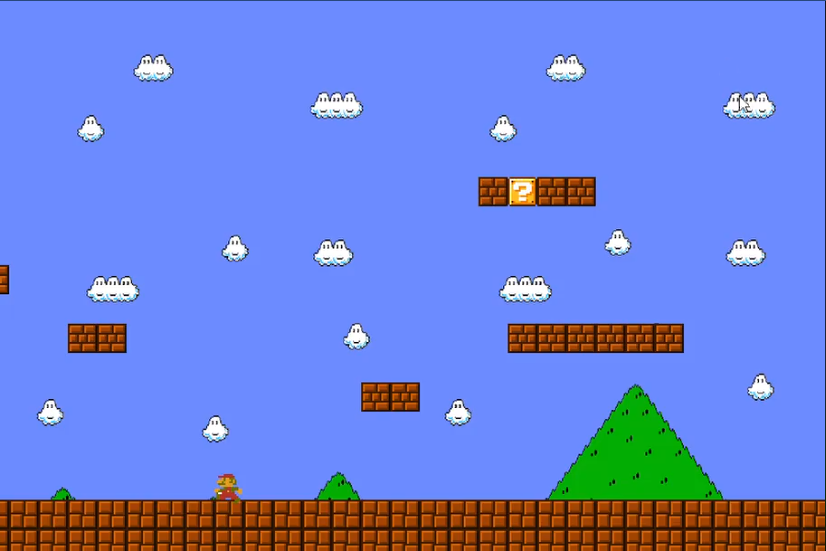

# Super Mario 2.0

A 2D side-scrolling platformer written in C++17 with [SFML](https://www.sfml-dev.org/) 2.6.



## Build & run

See [docs/BUILD.md](docs/BUILD.md). In short, from the `SuperMario 2.0/` directory:

```sh
cmake -S . -B build -DCMAKE_BUILD_TYPE=Release
cmake --build build --parallel
cd build && ./SuperMario2
```

## Controls

| Key            | Action            |
|----------------|-------------------|
| ← / →          | Move              |
| Space          | Jump              |
| Escape         | Pause / resume    |
| ↑ / ↓ + Enter  | Navigate menus    |

## Documentation

- [Architecture](docs/DESIGN.md)
- [Roadmap](docs/ROADMAP.md)
- [Build guide](docs/BUILD.md)

## Credits

Originally a school project. Tile and audio assets are the property of their
respective owners and are used here for educational purposes only.
